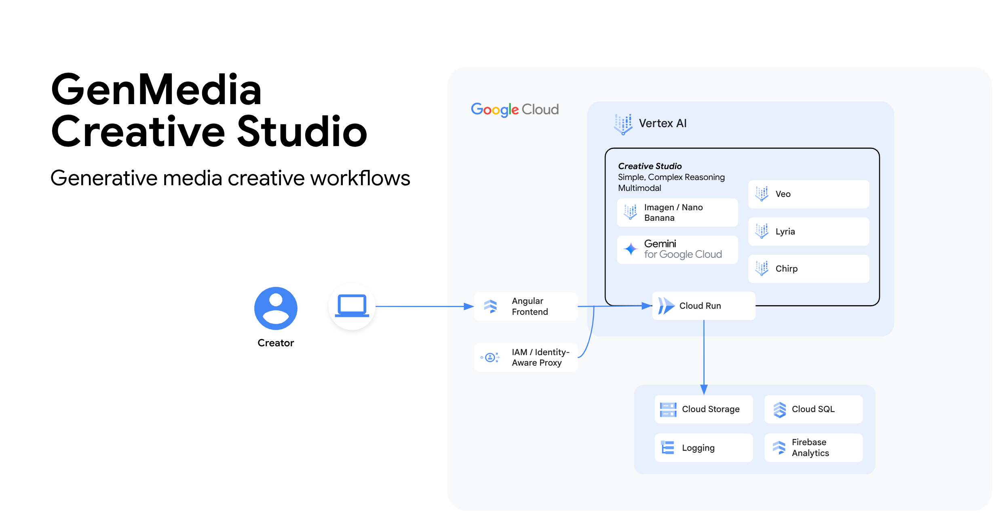
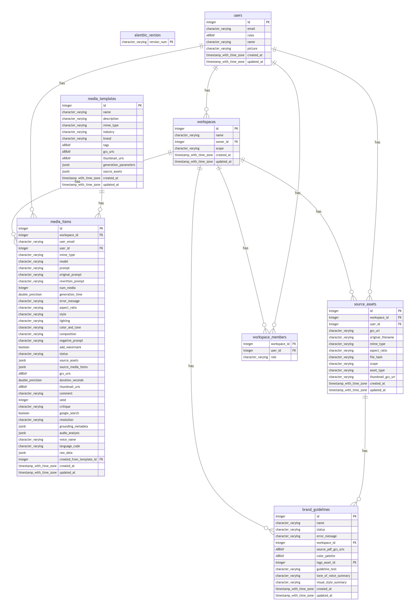

# Creative Studio Backend

## System Architecture and DB Schema



The backend follows a **Modular, Feature-Driven Architecture**, heavily inspired by the principles of Hexagonal Architecture (Ports & Adapters).

* **Structure:** Code is organized by feature domain (e.g., /images, /galleries, /users) rather than by technical layer (/controllers, /services).  
* **Rationale:**  
  * **Scalability:** This approach prevents individual directories from becoming unwieldy as the application grows.  
  * **Maintainability:** All code related to a single feature is co-located, making it easier to understand, modify, and test.  
  * **High Cohesion, Low Coupling:** Modules are self-contained and interact through well-defined interfaces (services and DTOs), making the system robust and flexible.

### Technology Stack

| Category | Technology / Service |
| :---- | :---- |
| **Frontend** | Angular, TypeScript, Angular Material, Tailwind CSS |
| **Backend** | Python, FastAPI, Pydantic |
| **Database** | Google Cloud SQL (PostgreSQL) |
| **Cloud Provider** | Google Cloud Platform (GCP) |
| **Deployment** | Cloud Run (for backend), Firebase Hosting (for frontend) |
| **AI Models** | Imagen, Veo, Gemini (via Vertex AI SDK) |

## 🚀 Backend Setup

To run the backend locally using Docker Compose, you need to configure the environment variables.

### 1. Configure `.env` file

Create a `.env` file in the `backend/` directory with the following content (replace values with your specific configuration):

```bash
# Common env vars
FRONTEND_URL="http://localhost:4200"
ENVIRONMENT="local"
LOG_LEVEL="INFO"

# Project ID: creative-studio-deploy
GOOGLE_CLOUD_PROJECT="creative-studio-deploy"
PROJECT_ID="creative-studio-deploy"
GENMEDIA_BUCKET="creative-studio-deploy-cs-development-bucket"
SIGNING_SA_EMAIL="cs-development-read@creative-studio-deploy.iam.gserviceaccount.com"
GOOGLE_TOKEN_AUDIENCE="XXXX-XXXXXXXXXXX.apps.googleusercontent.com"
IDENTITY_PLATFORM_ALLOWED_ORGS=""
```

### 2. Running the Application

We use Docker Compose to run the application locally. Please refer to the [Root README](../README.md#4-running-with-docker-compose) for detailed instructions on how to start the services.

If you want to start just the backend you can run the following command:

```bash
docker compose up backend
```

## Code Styling & Commit Guidelines

To maintain code quality and consistency:

* **Python (Backend):** We adhere to the [Google Python Style Guide](https://google.github.io/styleguide/pyguide.html), using tools like `pylint` and `black` for linting and formatting.

### Backend (Python with `pylint` and `black`)

1.  **Ensure Dependencies are Installed:**
    Add `pylint` and `black` to your `backend/requirements.txt` file:
    ```
    pylint
    black
    ```
    Then install them within your virtual environment:
    ```bash
    pip install pylint black
    # or pip install -r requirements.txt
    ```
2.  **Configure `pylint`:**
    It's recommended to have a `.pylintrc` file in your `backend/` directory to configure `pylint` rules. You might need to copy a standard one or generate one (`pylint --generate-rcfile > .pylintrc`).
3.  **Check for linting issues with `pylint`:**
    Navigate to the `backend/` directory and run:
    ```bash
    pylint .
    ```
    (Or specify modules/packages: `pylint your_module_name`)
4.  **Format code with `black`:**
    To automatically format all Python files in the current directory and subdirectories:
    ```bash
    python -m black . --line-length=80
    ```
